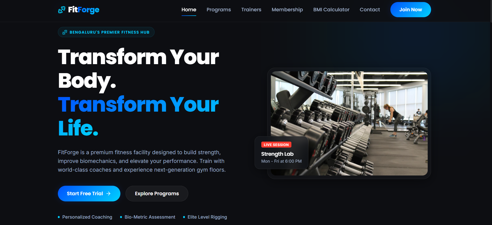
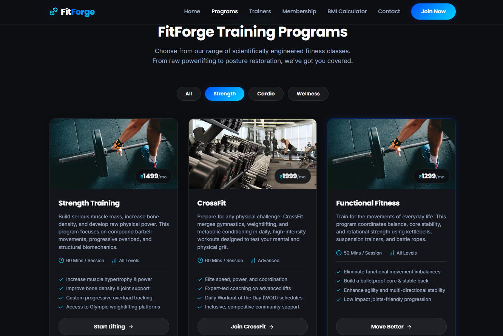
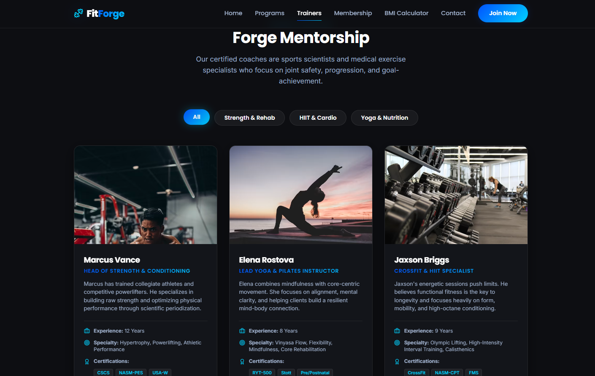
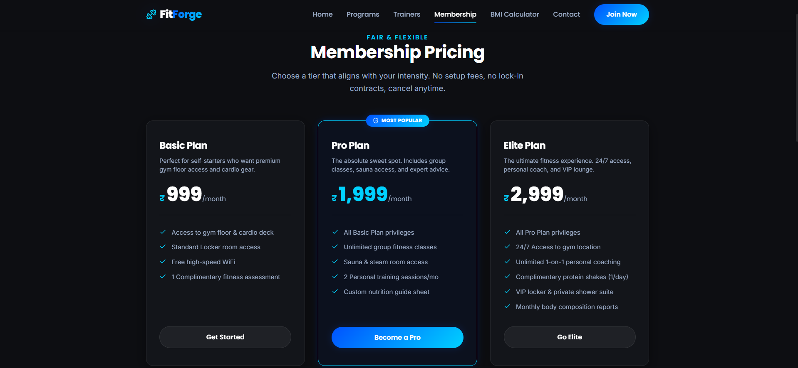
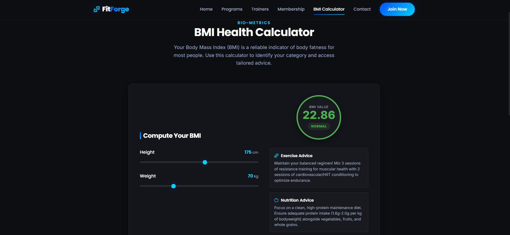
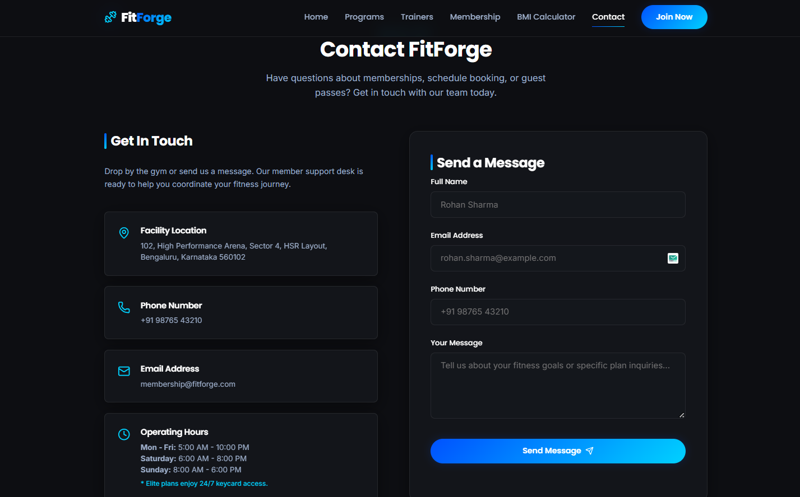

# 🏋️ FitForge

[](YOUR_VERCEL_URL)
[](https://github.com/harshita7126/FUTURE_FS_03)

> **Future Interns** • Full Stack Web Development Fellowship  
> **Track Assignment ID:** `FUTURE_FS_03`  

FitForge is a premium fitness and gym platform built using React, Vite, Framer Motion, and modern CSS3. The application provides an engaging digital experience for fitness enthusiasts through professional training programs, expert trainer profiles, membership plans, an interactive BMI calculator, and a responsive contact system.

Developed as part of the Future Interns Full Stack Web Development Internship Program (Task 3), FitForge focuses on modern UI/UX design, responsiveness, accessibility, and real-world business presentation.

---

## 📖 Project Overview

FitForge bridges the gap between premium fitness branding and fluid web application design. The platform acts as a commercial consumer hub designed to convert visitors into active gym members. It features an interactive single-page application flow, client-side logical data computation (via the BMI calculator), localized Indian standard pricing matrices, and smooth aesthetic layouts built from scratch without generic template dependencies.

---

## 🚀 Feature Highlights

- **Training Programs Hub**: Detailed catalog showcasing training tiers (Strength, Cardio, CrossFit, Yoga) with integrated filtering options.
- **Expert Trainer Directory**: Profiles displaying professional experience, specific certifications, and individual social links.
- **BMI Calculator Utility**: Live health scoring widget accepting dynamic metric height and weight inputs to display personalized fitness advice.
- **Membership Pricing Tables**: Clean commercial matrix featuring tiered packages (Basic: ₹999/mo, Pro: ₹1,999/mo, Elite: ₹2,999/mo) and plan highlights.
- **Smooth Animations**: Handcrafted micro-interactions, spring physics, and view entry transitions powered by Framer Motion.
- **Responsive Layouts**: Zero-overflow flexbox and CSS Grid foundations tested heavily across mobile, tablet, and desktop viewports.

---

## 🔗 Live Operations Deployment

| Deployment Vector | Live Demo Link | System Status |
| :--- | :--- | :--- |
| **Vercel Network** | Coming Soon *(Update with your specific FUTURE_FS_03 URL after deployment)* | 🟡 DEPLOYMENT PENDING |

---

## 📸 Project Screenshots

### Home Page Showcase



### Training Programs Grid



### Expert Coach Directory



### Membership Plans



### Interactive BMI Calculator



### Contact Page & Form



---

## 🛠️ Tech Stack

### Frontend Core

- React.js (Single Page Application architecture)
- Vite (Fast development server and bundler)
- React Router DOM (Client-side routing)
- Framer Motion (Scroll and interaction animations)
- Lucide React (Consistent iconography system)

### Styling & Theme Foundations

- CSS3 Native Variables
- Glassmorphism Design Elements
- Mobile-First Responsive Breakpoints

### Deployment

- Vercel Global Edge Network

---

## ✅ Build Verification

The application has been successfully compiled and verified for production deployment.

```bash
npm run build
```

### Output

```text
vite build
✓ Build completed successfully
```

---

## ⚙️ Local Development Setup

```bash
# Clone the repository
git clone https://github.com/harshita7126/FUTURE_FS_03.git

# Enter project directory
cd FUTURE_FS_03

# Install dependencies
npm install

# Start development server
npm run dev
```

---

## 👩‍💻 Author

**Harshita Labba**  
*B.Tech Computer Science & Engineering*  
*Future Interns – Full Stack Web Development Fellow*  

🔗 **GitHub:** [https://github.com/harshita7126](https://github.com/harshita7126)

---

## 📜 Academic & Internship Declaration

This project was developed as part of the Future Interns Full Stack Web Development Internship Program.

- **Intern Name:** LABBA HARSHITA
- **Internship Track:** Full Stack Web Development (FS)
- **Assignment ID:** FUTURE_FS_03
- **Internship Duration:** 22/05/2026 – 22/06/2026

---

## 📄 License

This project was developed for educational and internship purposes under the Future Interns Full Stack Web Development Fellowship Program.
